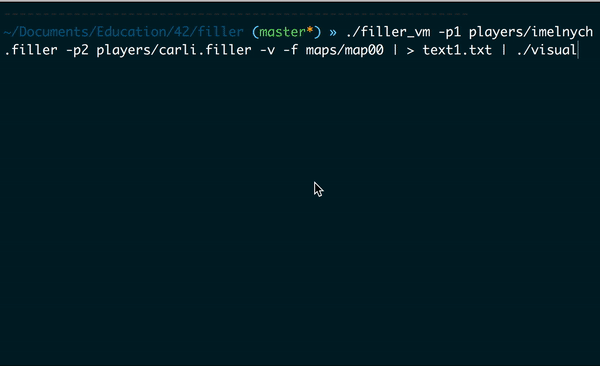

# Project Overview
Filler is a 42 Project to learn about AI. The game to fight other students on the Filler board. The concept is simple: two players gain points by placing on a board "o" and "x", one after another. To put a piece it needs to overlap ONE player's cell and only ONE and not overlap any of the challengers cells. As a part of bonus, visualisation is implemented.



# Goals
The goal of this project is to introduce you to basic algorithm and to have you manipulate
inputs/outputs.

# Installation
$> make

# Usage
```./filler_vm -p1 players/imelnych.filler -p2 players/PLAYER_NAME.filler -v -f maps/map00```
or visualize with
```./filler_vm -p1 players/imelnych.filler -p2 players/PLAYER_NAME.filler -v -f maps/map00 | ./visual```

# Bugs & drawbacks
The bot doesn't win in all the cases. It have an advantage on the big maps though.